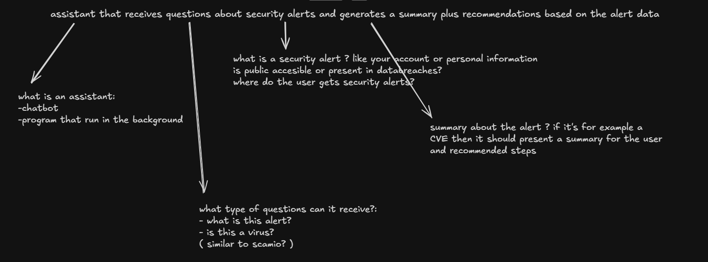

User thoughts at the finish of the home assigment: 
- started a bit late because other life events took over the designated time slots but managed to catch up using AI. This is not an excuse , mutch more of an observation.

Long story short of the journey of this assigment and usage about AI for each part:
Part 1: 
- first did myself an exploratory testing, identifing the major features of the product from which i had to write a test plan 
- drafted an inital test plan of what areas should be covered, then fired up Playwright MCP to let ai also do an exploration of the product and let it expand my draft. 
- Analizyed, polished, reprioritized , removed some of the tests and replaced with actual high value tests. ( i.e : i kept pushing back on the ai drafts — the plan talked about the asigment insted of the product, was full of buzzwords like "failure impact: critical" and had wrong priorities, so i made it redo it in plain words, after discovery of the actual app, and split clearly what we test from what we automate.)
Part 2:
- Then after i was satisfied with the plan and the scenarios , i've used Codex to implement the automated tests togheter with playwright mcp. 
- Agreed automation scope: which cases to automate vs. leave manual (registration stayed manual because of reCAPTCHA)( we will come back later for this )
- Started the Playwright project setup, models, fixtures, first tests
- Git init, built the full Playwright suite: 6 UI + 5 API tests, all 11 passing
- Added GitHub Actions: install → quality → typecheck → tests → report upload, plus the job-summary table | Added Biome (format + lint)

- Then i went back on the rechapcha subject where the ai said it cannot be automated because of the constraints of it. but i remembered that during the exploratory testing i never got any popup to validate my human form, so i pushed a bit further with deepseek to see if we could find a way around it and create the account through a ui e2e test instead of the api. more about this in: [Automating the Registration Flow with a Stubbed reCAPTCHA](part-2-test-automation/docs/recaptcha-stub.md) — the passages that matter are ["Did we find a bug?"](part-2-test-automation/docs/recaptcha-stub.md#did-we-find-a-bug) (the vanishing error message) and ["Is this a security flaw?"](part-2-test-automation/docs/recaptcha-stub.md#is-this-a-security-flaw) (the CAPTCHA protects nothing, server never checks the token).

Part 3: 
- Here firstly i wanted to see what ai would output without any context , just the plain exercise, but i wasn't satisfied with the response, it was vague and basically ai slop.
- Then i started to analyze throroughly the requirements of the task. Realized that they are to vague, an came to the conclusion of :how do test a non-deterministic system that produces a response, and another non-deterministic system tries to decide whether the response is good. 
- Here is a verry incipent draft of my analysys 
- I started the analysis from this draft image, and I used ChatGPT to create a test strategy.
- Then I thought that without knowing exactly how the assistant works, I should create a decision tree, so from each assumption I can derive a different test plan. the full interactive tree lives here: [decision-tree.html](part-3-ai-test-strategy/decision-tree.html)

